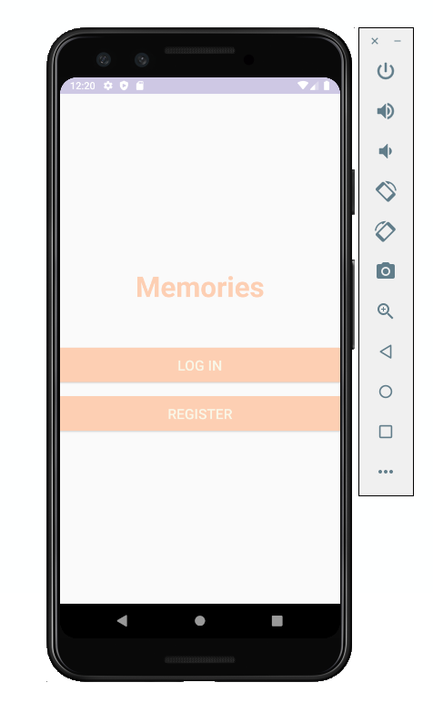
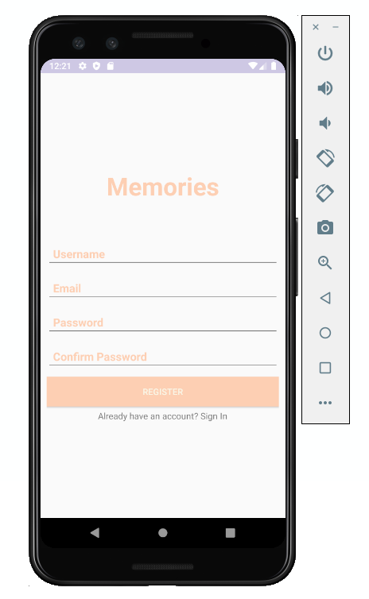
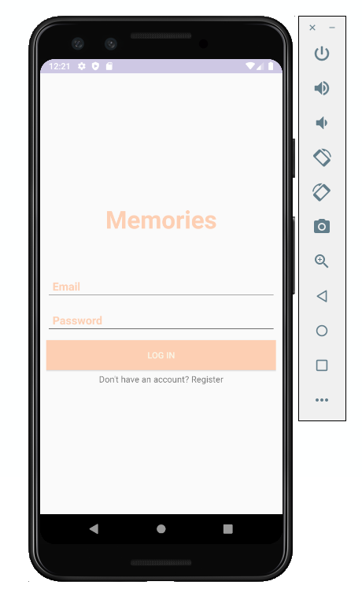

# Photo_Memories
Android Application: Memories

Mobile app to store and organize photos of your events or "memories".  
This app allows users to:
 - Create new memories and add a title, location, and date. 
 - Create new posts for an memory with a date, location, and description along with an image from their phone (album or camera).
 - Save images to phone under the file name "Memories"
 - Edit the memory or post description.
 - Delete posts or memories.
 
 
 
 
 Tools used:
 - Firebase Auth
 - Firebase Realtime Database
 -Firebase Storage
 - Image Cropper library: https://github.com/ArthurHub/Android-Image-Cropper
 - Runtime Permissions Check library: https://github.com/ParkSangGwon/TedPermission
 - Image loading and caching library: https://github.com/bumptech/glide
 - "Icon made by Freepik from www.flaticon.com"
 
 
 
 
 ## View Memories
 
 
 ## Create New Memory
 
 
 ## Add New Post
 
 
 ## Save Image
 
 
 ## Edit Post Description
 
 
  ## View All Photos
 
 
 
 ## Start, Register, Login
 
 
 
 
 
 
